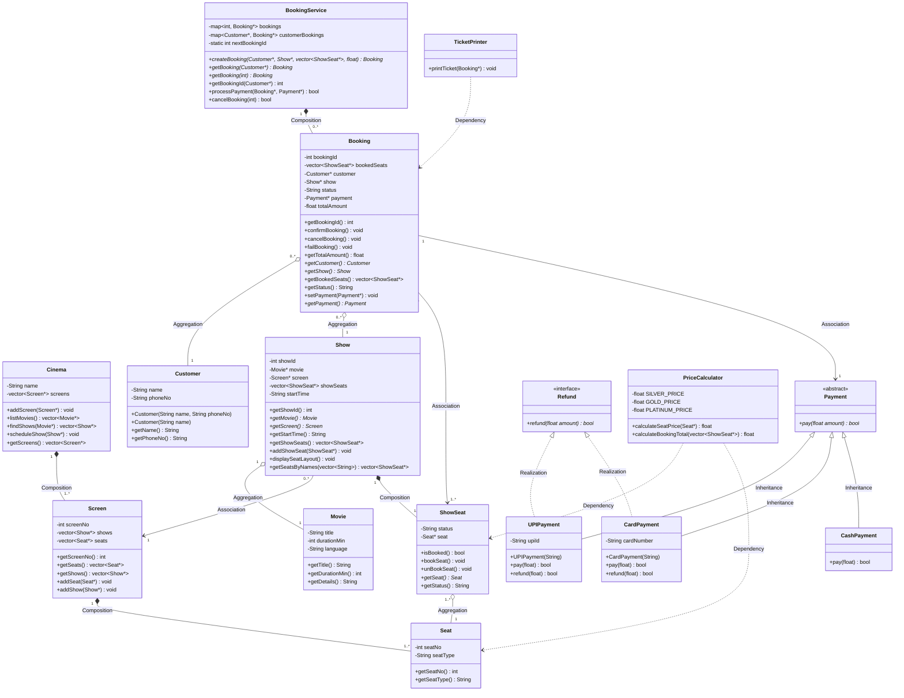
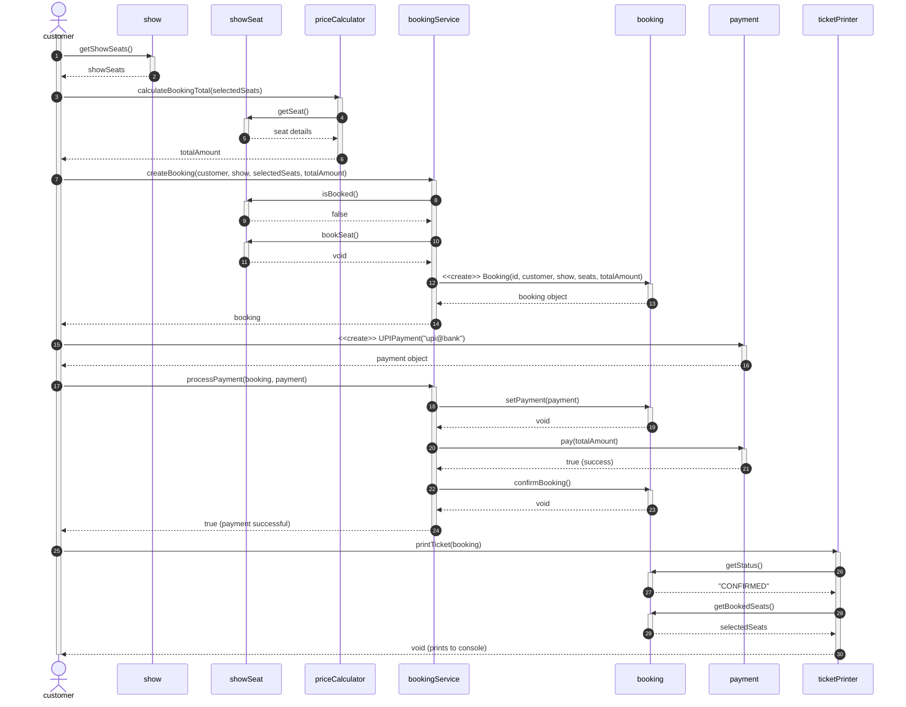

# Movie Ticket Booking System

A console-based application for booking movie tickets built in C++. This project demonstrates core Object-Oriented Programming (OOP) concepts and SOLID principles.

## Functional Requirements (FR)
- **FR1 — Browsing**: a customer views a list of all movies currently playing. Each movie displays its title, language, and duration.
- **FR2 — Shows**: for a selected movie, the system displays all available shows, including the screen number and start time.
- **FR3 — Seat Layout**: for a selected show, the system prints a categorized seat layout (SILVER, GOLD, PLATINUM) with each seat marked clearly as AVAILABLE or BOOKED.
- **FR4 — Booking**: a customer selects one or more seat numbers for a show. If any selected seat is already BOOKED, the whole booking is rejected and no seat changes state. Booking is confirmed only after payment succeeds.
- **FR5 — Pricing**: the total booking amount is dynamically calculated based on seat types: SILVER (₹150), GOLD (₹250), PLATINUM (₹400).
- **FR6 — Payment**: exactly one method (UPI / Card / Cash) per booking. If payment fails, seats are released and booking status becomes FAILED.
- **FR7 — Ticketing**: after successful payment, a formatted ticket is printed showing booking ID, movie name, screen, time, booked seat numbers, total amount, and CONFIRMED status.
- **FR8 — Cancellation**: a customer cancels an existing CONFIRMED booking. The associated seats immediately revert to AVAILABLE status and the payment is refunded.

## Non-Functional Requirements & Assumptions
- **NFR1 — Robustness**: Invalid input is handled gracefully with clear feedback to the customer, ensuring the system does not crash.
- **NFR2 — Simulated Payments**: Actual payment gateway processing is out of scope — payment methods are simulated to succeed (or fail based on hardcoded demo data).
- **NFR3 — Static Seed Data**: Currently playing movies, screens, and shows are static seed data initialized at startup, rather than being fetched in real-time from a database.

## Noun-Verb Analysis (Class Identification)
Based on the problem statement, the following nouns were identified to become classes:
- **Movie**: has its own data and identity.
- **Cinema**: has its own data and identity.
- **Customer**: interacts with the system.
- **Seat**: has a number, type, and price.
- **Show**: has timing and screen information.
- **Booking**: represents booking information and state.
- **Screen**: a cinema can contain multiple screens.
- **ShowSeat**: tracks whether a specific seat is booked for a specific show.
- **Payment**: represents a distinct transaction.

## Architecture & Diagrams
The system is built with modularity in mind. Each class resides in its own file.
Core entities include `Movie`, `Seat`, `Screen`, `Cinema`, `Show`, `ShowSeat`, `Customer`, and `Booking`. Service and behavior logic is separated into `PriceCalculator`, `TicketPrinter`, and `BookingService`.

### UML Class Diagram


### Sequence Diagram: "Customer books 1 seat and pays by UPI"


## How to Run
1. Ensure you have a C++ compiler installed (like g++).
2. Open a terminal in the project directory.
3. Compile the source code:
   ```bash
   g++ main.cpp -o app
   ```
4. Run the executable:
   ```bash
   ./app
   ```
   *(On Windows, use `.\app.exe`)*
